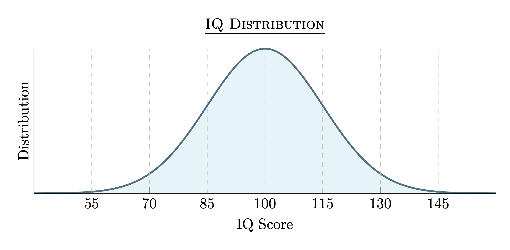

# Feature Showcase

This document demonstrates all the features available in the typst-pandoc converter.

## Text Formatting

Basic formatting includes **bold**, *italic*, and ***bold italic*** text. You can also use ~~strikethrough~~ and `inline code`.

## Headings

### Level 3 Heading
#### Level 4 Heading
##### Level 5 Heading
###### Level 6 Heading

## Lists

### Unordered Lists
* Item 1
* Item 2
  * Nested item 2.1
  * Nested item 2.2
* Item 3

### Ordered Lists
1. First item
2. Second item
   1. Nested item 2.1
   2. Nested item 2.2
3. Third item

### Definition Lists
Term 1
: Definition 1

Term 2
: Definition 2.1
: Definition 2.2

## Tables

| Feature | Description | Support |
|---------|------------|---------|
| Tables | Basic tables with alignment | ✓ |
| Lists | Ordered and unordered lists | ✓ |
| Code | Syntax highlighting | ✓ |

## Code Blocks

```python
def hello_world():
    print("Hello, World!")
```

```typescript
function greet(name: string): void {
    console.log(`Hello, ${name}!`);
}
```

## Blockquotes

> This is a blockquote.
> It can span multiple lines.
>> And it can be nested.

## Images

Here's an example image:

{ width=75% }

## Mathematical Equations

Inline math: $E = mc^2$

Display math:

$$
\int_{a}^{b} x^2 dx = \left[\frac{x^3}{3}\right]_{a}^{b}
$$

## Cross-references

See [Tables](#tables) for more information.

## Abbreviations

The HTML{.abbr title="HyperText Markup Language"} specification is maintained by the W3C{.abbr title="World Wide Web Consortium"}.

## Footnotes

Here's a sentence with a footnote[^1].

[^1]: This is the footnote content.

## Bibliography

Here's a citation [@doe2023example].

## Horizontal Rule

---

## Custom Divs

::: {.warning}
This is a warning message styled with custom CSS.
:::

::: {.note}
This is a note message styled differently.
:::
