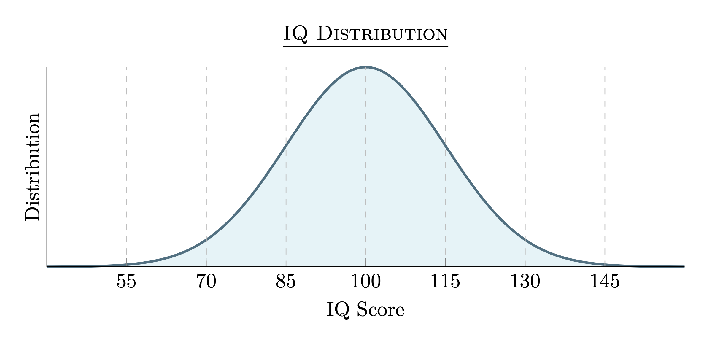

# Introduction

::: {.quote author="Jane Doe"}
The only limit to our realization of tomorrow is our doubts of today.
:::

Welcome to this comprehensive **Pandoc & LaTeX Feature Test**. This document is meant to exercise as many Markdown, Pandoc, and LaTeX constructs as possible, including:

- Headings of various levels
- Emphasis (italic, bold, bold-italic, strikeout)
- Inline and display mathematics
- Footnotes and citations
- Blockquotes (including nested)
- Lists (unordered, ordered, nested, definition lists)
- Tables (pipe tables, grid tables)
- Fenced code blocks with syntax highlighting
- Images with attributes
- Links (inline, reference-style, auto-links)
- Abbreviations and citations
- Raw LaTeX and raw HTML blocks
- Divs with custom attributes
- Horizontal rules
- Definition lists
- Cross-references and headings references

Let’s dive in.

---

## Emphasis and Inline Code

You can have *italic* text, **bold** text, and ***bold-italic*** text all in one paragraph.  
Strikeout is also supported via ~~strikethrough~~.

Inline code: ``printf("Hello, World!\n");`` is rendered as code.

You can use backticks in code spans by wrapping in more backticks, e.g.:

````markdown
``This is a `code` span``
`````

---

## Mathematics

Inline math can be written as $E = mc^2$ or `$a^2 + b^2 = c^2$`.

Display math is surrounded by `$$ ... $$`:

$$
\int_{0}^{\infty} e^{-x^2} \, dx = \frac{\sqrt{\pi}}{2}
$$

You can also include LaTeX environments like `align` (requires `--mathjax` or a LaTeX engine):

```latex
\begin{align}
  f(x) &= x^2 + 2x + 1 \\
  g(x) &= \sin(x) + \cos(x)
\end{align}
```

Rendered as:

$$
\begin{align}
  f(x) &= x^2 + 2x + 1 \\
  g(x) &= \sin(x) + \cos(x)
\end{align}
$$

---

## Footnotes

This sentence has a footnote.[^1]

[^1]: This is the footnote text with some \*formatting\* and a citation [@doe2023example].

Another sentence with multiple footnotes.[^a][^b]

[^a]: First footnote text.

[^b]: Second footnote text, referencing a LaTeX macro: \$\alpha + \beta = \gamma\$.

---

## Citations

Here is a citation to a classic work in adaptation: [@doe2023example].
Multiple citations: [@doe2023example; @smith2024handbook].
Citation with page number: [@smith2024handbook p. 42].

If you have multiple bibliographies, you can specify in frontmatter (not shown here).

---

## Blockquotes

> This is a top-level blockquote.
>
> > This is a nested blockquote.
> >
> > * And it can contain lists
> > * Or other blockquotes
> >
> >   > Nested again!
>
> Back to level 1.
> And you can include formatting like **bold** and *italic* inside.

---

## Lists

### Unordered Lists

* Level 1, item 1
* Level 1, item 2

  * Level 2, item 1

    * Level 3, item 1
    * Level 3, item 2
  * Level 2, item 2
* Level 1, item 3

### Ordered Lists

1. First item
2. Second item

   1. Sub-item (a)
   2. Sub-item (b)

      1. Sub-sub-item (i)
      2. Sub-sub-item (ii)
3. Third item

### Definition Lists

Term 1
: Definition of term 1, which can be quite long and wrap onto multiple lines.
Still part of the same definition.

Term 2
: Definition of term 2.

---

## Tables

### Pipe Table

| Syntax   | Description         | Test              |
| -------- | ------------------- | ----------------- |
| Header 1 | Header 2            | Header 3          |
| `:--`    | `--:` (right align) | `:-:` (center)    |
| Left     | Right               | Center            |
| **Bold** | *Italic*            | ~~Strikethrough~~ |


## Images

Here is an image with attributes:

{ width=50% height=auto alt="Example PNG" }

---

## Links

* Inline link: [Pandoc Homepage](https://pandoc.org)
* Reference-style link: [GitHub][gh]
* Auto-link: [https://www.example.com](https://www.example.com)

[gh]: https://github.com "GitHub"

---

## Abbreviations

This document uses abbreviations such as HTML{:.abbr}, LaTeX{:.abbr}, and PDF{:.abbr}.

> **Note:** To enable abbreviations, compile with `--abbreviations`.

---

## Definition Lists with Inline Formatting

Pandoc Markdown also supports definition lists with inline code and formatting:

```markdown
Markdown
: A lightweight markup language with plain-text formatting syntax.

LaTeX
: A document preparation system and markup language for typesetting.

Pandoc
: A universal document converter.
```

Renders as:

Markdown
:  A lightweight markup language with plain-text formatting syntax.

LaTeX
:  A document preparation system and markup language for typesetting.

Pandoc
:  A universal document converter.

---

## Raw LaTeX and Raw HTML Blocks

Raw LaTeX example:

```latex
\begin{theorem}
  Let \(G\) be a group. Then \(G\) has a unique identity element.
\end{theorem}
```

Raw HTML example:

```html
<table>
  <tr><th>HTML</th><th>Table</th></tr>
  <tr><td>Row A</td><td>Row B</td></tr>
</table>
```

When converting to LaTeX, the HTML block will be ignored (unless you use `--filter pandoc-citeproc` or similar). Conversely, when converting to HTML, the LaTeX block is ignored.

---

## Fenced Code Blocks

### Python Example

```python
def fibonacci(n):
    """Return the n-th Fibonacci number."""
    a, b = 0, 1
    for _ in range(n):
        a, b = b, a + b
    return a

print(fibonacci(10))  # Should print 55
```

### Shell Example

```sh
#!/usr/bin/env bash
# Example build script snippet

pandoc chapters/*.md \
  --metadata-file=metadata.yaml \
  --to=pdf \
  --pdf-engine=xelatex \
  -o output/book.pdf
```

### LaTeX Example

```latex
\documentclass{article}
\begin{document}
Hello, LaTeX world!
\end{document}
```

## Divs and Custom Attributes

You can create custom‐attributed Divs to test Pandoc’s extension:

```markdown
::: warning
**Warning:** This is a custom‐styled warning block.
:::

::: note
**Note:** This is a custom note block with *italic* and **bold**.
:::
```

Pandoc will translate these into `<div class="warning">` or `<div class="note">` in HTML, or into custom wrappers if you use a LaTeX template that recognizes `warning` and `note`.

## Horizontal Rules

Use three or more hyphens or asterisks:

---

---

---

---

## Cross-references

If you label a heading, you can refer to it later. For example:

```markdown
## Methods {#sec:methods}

Details about methods...

As discussed in [Section 2.1](#sec:methods), we see that...
```

[Section 2.1](#cross-references)

[\@ref(cross-references)]

After processing (e.g., via `--number-sections --reference-links`), “Section 1.1” (or similar) is automatically inserted.

## Conclusion

This document has exercised a wide variety of Pandoc Markdown and LaTeX constructs. Use this as a template to test converters, templates, filters, and engines.

Feel free to modify, extend, or trim sections to suit your testing needs.